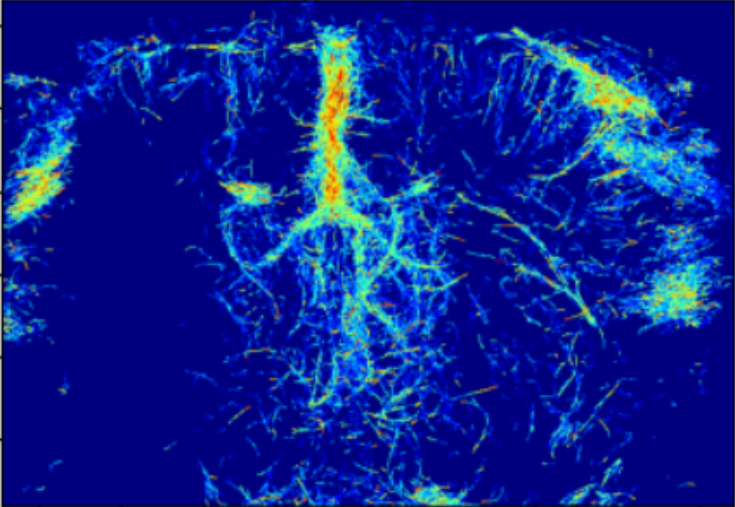

# Open-3DULM : 3D Ultrasound Localization Microscopy Pipeline



This repository contains the complete source code for the 3D **ULM (Ultrasound Localization Microscopy)** pipeline, designed for microbubble detection and tracking. 

To address various performance and experimental requirements, the code has been split into **4 distinct approaches**:
1. **CPU Approach (NumPy)**: The baseline method, without hardware-specific optimization.
2. **GPU Approach (PyTorch)**: Massive optimization utilizing tensor operations on the graphics card.
3. **YOLO Approach (GPU + AI)**: Replaces the classic Region of Interest (ROI) extraction with a convolutional neural network.
4. **RF-DETR Approach (GPU + AI)**: An alternative AI approach leveraging the RF-DETR transformer model for precise microbubble detection.

---

## ??? Installation & Setup

To install the pipeline and all its dependencies (including YOLO, RF-DETR, and tracking tools) in your environment:

1. **Activate your environment**:
   ```bash
   source $HOME/my_occidata_env/bin/activate
   ```

2. **Install in editable mode**:
   ```bash
   cd Open-3DULM-main
   pip install -e .
   ```
*This command uses `setup.py` to automatically install requirements and links the `ulm3d` package to your source folder for immediate updates.*

---

## ?? Repository Contents & Code Architecture

### ?? Main Launcher
* **`open_3D_ulm_main.py`**: This is the central script (the entry point). It reads the YAML configuration file, handles multiprocessing (if applicable), and instantiates the correct ULM class based on the chosen backend (`numpy`, `torch`, `yolo`, or `rfdetr`).

### ?? Core ULM Pipeline (Classes)
These files contain the overall logic of the ULM method (filtering, localization, tracking):
* **`ulm.py`**: Default (legacy) file. Executes the classic pipeline on the CPU by calling the NumPy version of the radial symmetry function.
* **`ulm_torch.py`**: GPU-optimized version. The structure is similar to `ulm.py`, but it leverages PyTorch to drastically accelerate computations and calls the optimized radial symmetry function.
* **`ulm_yolo.py`**: Hybrid AI/Algorithmic version. Retains PyTorch's GPU optimization but replaces the classic local maxima detection method (ROI calculation) with 3D inference via **YOLO** on MIP (Maximum Intensity Projection) projections.
* **`ulm_rfdetr.py`**: Alternative AI version. Integrates **RF-DETR** based detection into the ULM pipeline, functioning similarly to the YOLO approach but relying on a transformer architecture.

### ?? Localization Algorithms (Sub-pixel)
These scripts handle super-resolved localization at the geometric center of the microbubbles:
* **`radial_symmetry_center_numpy.py`**: 3D radial symmetry localization algorithm implemented in a standard way (loops and CPU calculations).
* **`radial_symmetry_center_torch.py`**: The same mathematical algorithm, rewritten for batched processing on the GPU via PyTorch. It includes a robust linear system resolution (Tikhonov Regularization).

### ?? Data Conversion & Formatting
The pipeline is optimized for `.npy` files to ensure maximum I/O speed.
* **`convert_mat_to_npy.py`**: Converts MATLAB `.mat` raw data to `.npy`.
* **`transforme_PALA-mat_PNG.py`**: Converts PALA `.mat` files into `.png` images (Required for RF-DETR datasets).
* **`transforme_PNG_COCOformat.py`**: Formats the generated `.png` images into the standard COCO format required for RF-DETR training.

### ??? Visualization & Rendering
* **`display_3D_ulm.py`**: A post-processing script that recursively scans result directories for generated volumes (`.hdf5` or `.npz`) and automatically renders 2D Maximum Intensity Projections (MIPs) for Density, Velocity, etc. Runs in headless mode.

### ?? AI Training Utilities (YOLO & RF-DETR)
These supplementary scripts are only necessary if you want to retrain the AI detection models:
* **`prepare_yolo_dataset.py`**: Injects customizable realistic noise into raw IQ data, extracts frames, and creates YOLO-format bounding boxes for `train` and `val` sets.
* **`training_YOLO.py`**: Training script (Fine-tuning) for the YOLO model.
* **`train_rfdetr.py`**: Training script (Fine-tuning) specifically designed for the RF-DETR architecture.

### ?? Testing & Validation
* **`banc_dessai.ipynb`**: A Jupyter Notebook designed as a test bench to compare outputs, validate accuracy, and track errors between the original CPU pipeline and the GPU-optimized pipelines.

---

# ?? Open-3DULM: SLURM Execution Scripts

This repository contains bash scripts (`.sh`) to run the Open-3DULM pipeline on a computing cluster using **SLURM**. 

All scripts use a Singularity container (`pytorch-NGC-25-01.sif`) ensuring a stable execution environment pre-installed with CUDA 12 and PyTorch.

---

## ?? 1. ULM Pipeline Execution (Inference & Reconstruction)

These scripts execute the complete 3D ULM reconstruction pipeline (`open_3D_ulm_main.py`) depending on your chosen compute engine.

### ?? `Run_yolo_ULM.sh` (Backend: YOLO on GPU)
Runs the pipeline using **YOLO** to intelligently detect microbubble ROIs via MIP projections.
* **Allocated Resources**: 1 GPU, 4 CPUs (`--cpus-per-task=4`).
* **Specifics**: Uses `--backend "yolo"` and requires the `--yolo-model` parameter pointing to the trained weights (e.g., `best.pt`). CPUs are used to prevent data-loading bottlenecks to the GPU.

### ?? `Run_rfdetr_ULM.sh` (Backend: RF-DETR on GPU)
Runs the pipeline using the **RF-DETR** model for ROI detection.
* **Specifics**: Operates exactly like the YOLO script (uses 1 GPU, 4 CPUs) and accepts the same arguments, but routes the inference through the RF-DETR transformer model via `ulm_rfdetr.py`.

### ? `Run_torch_ULM.sh` (Backend: PyTorch on GPU)
Uses the classic analytical method for local maxima detection, massively parallelized on the graphics card using **PyTorch** tensors.
* **Allocated Resources**: 1 GPU, 2 CPUs. Highly optimized and extremely fast as heavy mathematical operations are handled directly by the GPU.

### ?? `Run_numpy_ULM.sh` (Backend: NumPy on CPU)
Runs the historical algorithmic pipeline entirely on the processor (CPU). Serves primarily as a baseline or as a fallback solution if GPU nodes are unavailable.
* **Allocated Resources**: 48 CPUs, 160 GB RAM.
* **Specifics**: 3D matrix calculations on the CPU require massive amounts of RAM. Processing is distributed across 48 cores to compensate for the slower calculation speed.

---

## ?? 2. Preparation and Training Scripts (AI Models)

For the YOLO or RF-DETR backends to function during inference, a model must first be trained on our in silico flow data.

### ??? `Run_prepare_YOLO_dataset.sh`
Automatically generates the dataset for YOLO training from raw IQ data (`prepare_yolo_dataset.py`).
* Generates images with various noise levels (e.g., `--noise-levels 10 15 20` in dB).
* Creates the folder structure and `dataset.yaml` files.
* Sets bounding box sizes around microbubbles via `--box-size`.

### ??? `Run_train_YOLO.sh`
Launches the fine-tuning of the YOLO model (`training_YOLO.py`). It uses a base pre-trained model and adapts it to our microbubble signatures.
You can finely tune the training process using the following hyperparameters:
* `--epochs` (default: 200): Total number of training epochs.
* `--patience` (default: 30): Early stopping patience (stops if no improvement).
* `--imgsz` (default: 160): Image size used for training.
* `--batch` (default: 16): Batch size per training step.
* `--device` (default: "0"): GPU device ID to use.
* `--optimizer` (default: "AdamW"): Optimizer algorithm.
* `--workers` (default: 0): Number of CPU workers for data loading.
* `--mosaic` (default: 0.0), `--scale` (default: 0.05), `--flipud` (default: 0.5): Data augmentation parameters to make the model more robust.
* `--box` (default: 15.0), `--cls` (default: 2.0): Loss weighting parameters to balance box regression and classification.

### ??? `Run_train_RFDETR.sh`
Launches the classic training process for the **RF-DETR** model via `train_rfdetr.py`. It does not require specific arguments for standard execution and handles the fine-tuning of the transformer architecture on your formatted COCO dataset.

---

## ?? 3. Post-Processing & Visualization

### ??? `Run_display_img.sh`
Recursively searches for generated `.hdf5` and `.npz` volumes in your results folder and automatically renders 2D projection images (Density, Velocity, Power Doppler) as `.png` files.
* **Allocated Resources**: 1 CPU, 40 GB RAM.
* **How it works**: Runs `display_3D_ulm.py` in headless mode to prevent display/GUI errors on the cluster. Provide the root results directory via the `--input` argument.